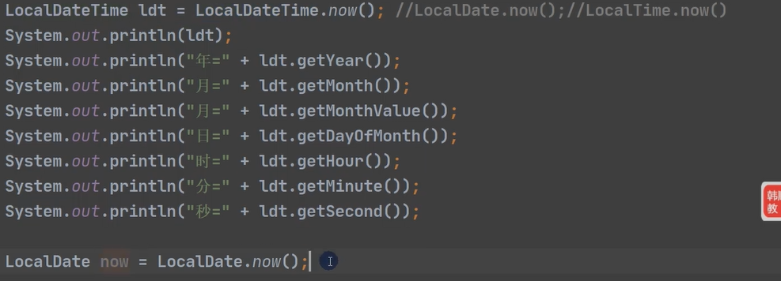

# java-test01
java220104
### 命名：

类名：首字母大写，每个单词大写

变量名与方法名：首字母小写，每个单词小写

### 可变参数

`public int sum(int... nums){`

`}`

// nums可以视作数组

可变参数可以与其它参数放在一起，但必须放在最后

### 作用域

#### 全局变量与局部变量

##### 作用域

全局变量作用域为整个整体类

局部变量作用域为定义它的代码块

##### 赋值

全局变量可以不赋值，因为有默认值

局部变量必须赋值后才可以使用

##### 修饰符

全局变量可加修饰符

局部变量不可以

### 构造器

定义属性的类

一个类定义多个构造器，其名称要与类名相同，没有返回值，

是为了完成对象的初始化

构造器可以视为方法

如果没有定义构造器，系统会自动给类定义一个无参构造器

#### this的用法

是为了，将构造器的形参直接写成属性名

this 当前对象的属性

this 可以用一个构造器去访问另一个构造器

### 四种权限修饰符

|           | Public | protected | (default) | private |
|-----------|:------:|:---------:|:---------:|:-------:|
| 同一个类      |  yes   |    yes    |    yes    |   yes   |
| 同一个包      |  yes   |    yes    |    yes    |   no    |
| 不同包，但父子关系 |  yes   |    yes    |    no     |   no    |
| 不同包，非父子关系 |  yes   |    no     |    no     |   no    |

### 构造器

直接使用构造器指定属性，可在构造方法中使用this.set

this 与 super 必须放在构造器的首行

### 多态的表现

对象的编译类型与运行类型可以不一致

### equals的作用

判断值是否相等，与==不同

### hash Code

判断哈希值

### 静态方法

静态方法可以通过类名来调用<!--  -->
###  静态变量
即加上static
被所有对象所共享
类变量可通过类名直接访问
### 静态方法
静态方法可以访问静态属性
希望不创建实例也可调用某方法（即当作工具来使用），此时适宜将该方法当作静态方法
静态方法不可使用与对象有关的关键字，this与super
静态方法只能访问静态变量
普通方法可以访问静态或非静态方法（成员）

静态方法main可以访问本类中的静态成员，不可访问非静态成员
静态方法main要访问本类中的非静态成员，可先创建对象再调用即可
### 代码块
静态与非静态代码块
不管使用哪个构造器，都会先调用代码块中的内容，代码块的调用优先于构造器
静态代码块随类的加载而执行，普通代码块在创建对象时执行（调用类的静态成员时不执行），
无参构造器内第一句是一个隐藏的super(); 随后再调用普通代码块
##### 调用顺序如下：
父类的静态代码块与属性
子类~~
父类的普通代码块与属性
父类方法
子类~~
子类~~
### final关键字
final可以修饰类，属性，方法和局部变量
使其不被继承，覆盖重写，属性与局部变量被修改
final修饰的属性可称之为常量，用XX_XX_XX来命名
### 抽象类
父类的一些方法不确定时，用abstract修饰，方法与类，
抽象方法不能有主体，即不能实现，
抽象方法不可用private，final，static修饰，因其与重写相违背
### 接口
给出一些没有实现的方法，封装到一起，某类使用时，再写出，接口中抽象方法可以省略abstract关键字，
普通类必须实现接口的所有方法
抽象类可以不实现接口的抽象方法
一个类可以同时实现多个接口，
接口的属性只能是final的，默认为public static final（可省略）
接口不可继承其他类，但可以继承多个别的接口
接口的多态：接口的变量类型可以指向实现了该接口的对象实例 
### 内部类
#### 局部内部类（有类名）-->类似于局部变量
作用域仅限于定义它的方法或代码块中
/不是静态属性，不能直接访问，可加this
#### 匿名内部类（无类名）
本质也是类，没有名字，同时也是一个对象
不重写父类可使用super
#### 成员内部类
成员内部类访问外部类成员，直接访问
外部类访问成员内部类，先创建对象再访问
外部其他类--访问---成员内部类
#### 静态内部类
可以访问外部类所有成员，不可访问非静态成员，可以添加任意访问修饰符
### 枚举类
把具体的对象一个一个列举出来，只读，不需要修改
1.构造器私有化，去掉setXXX相关方法，防止属性被修改，直接创建固定的对象
2.方法二，使用enum来替代class
写常量（对象），须写在最前面
也可用无参构造器创建常量对象，其可省略（）
### 注解
Override 检测是否覆盖重写
Deprecated 修饰某元素，表过时
SuppressWarnings 抑制警告信息
### 异常 
try{代码块
}catch{抛出信息
}finally{始终表达的信息
}
可多个catch语句
异常的提示信息
throws抛出
编译异常，程序必须处理，try-catch或者throws
运行时异常若无处理默认throws
子类重写父类时父类需与一致或为其子类
若有try-catch则无需throws
 Exception编译异常
 RuntimeException运行时异常
### 包装类
装箱： 基本数据类型int  → 包装类型Integer
自动装调用valueOf，如Integer.valueOf()
手动拆箱 i = integer.intValue();
### String类字符串
String s1 == "java";
String s2 ==  new String("java");
String与StringBuffer与StringBuilder
### 常见类math等，
math，Arrays ,System
toString的用法
BigInteger大数字的存储
BigDecimal大数字浮点
Data ，simpleDataFormat
Calendar
LocalData，~Time， ~DataTime

String.format的用法，s%，%c
### 集合

迭代器iterator

#### ArrayList和LinkedList

两种类是基于List接口的

分别是基于数组与链表

增强for

#### HashSet与TreeSet

二者是基于set接口，其特点，无序，无索引，不允许重复元素

适时情况需要重写hashCode()和equals()方法

其中linkedhashset加入与取出元素的顺序需要一致

添加xxx.add

### Map接口

是HashMap

Map中有key和value，其可以是任意引用的数据，key不可以重复，value可重复，key最多一个为null

value可以多个为null，

添加xxx.put

底层：数组加链表加树，初始大小16，扩容\*2，扩容临界值*0.75

HashTable线程安全，HashMap线程不安全

### TreeSet

元素有序，元素首字母排序

### 泛型

可对ArrayList中的数据进行约束

免去类型转换

泛型在指定类型后，可以传入该类型或其子类型

可以有泛型方法，泛型类	

#### Junit

@Test 可以测试

### 事件

事件监听器

### 线程

继承Thread类

实现Runnable接口

interruput 中断线程，

插队，join

守护线程 xxx.setDaemon(ture)

线程同步

### IO流

字节流与字符流

节点流

处理流/包装流

***接收子类对象***

是否覆盖文件添加ture

字符流BufferReader，BufferWriter

字节流BufferedInputStream，BufferedOutputStream

#### 对象流

Serializeble 需要序列化某对象，则该对象需要先实现化该接口

Externalizeble

序列化与反序列化需要按顺序

Static和Transient修饰的成成员不会序列化，对象里的属性类型需要时实现了序列化接口的

标准输入输出流

字节流 FileInputstream 转成字符流InputstreamReader指定编码gbk/utf-8

### 反射

得到class对象的各种方式

1. Class.forName 读取配置文件
2. 类名.class 用于参数传递
3. 对象.getClass() 有对象实例时
4. 类加载器.loadClass() 通过类加载器

反射是动态加载，在运行时且执行时加载，而不同于静态加载
反射

### MySQL

连接mysql

mysql -h 主机ip -P 端口 -u 用户名 -p密码

列（column）：表中的一个字段，一个表有一个或多个列组成。

行（row）：表中的一条记录

查看当前数据库 `select database();`

查看表 `show tables`

查看表中数据 `select * from 表名;`

查看表结构 desc 表名

\c终止，ctrl+c

#### 查询语句

#### DQL

查询字段

select 字段名 from 表名    多个可用“,” 隔开

起别名 as 可省略as

#### 条件查询

​	select

​			字段1，字段2，...

​	from

​			表名

​	where

​			条件;

模糊查询，%代表任意多个字符，_代表任意一个字符；

#### 排序

order by 字段 asc；升序

order by 字段 desc;   降序

##### 处理函数

##### 分组查询

内连接与外连接

right代表将join关键字右边的表看作主表，将其数据全部查询出来

主键和unique会自动添加索引

多对多，三张表，关系表两个外键

一对多，两张表，多的表加外键

一对一，外键唯一
